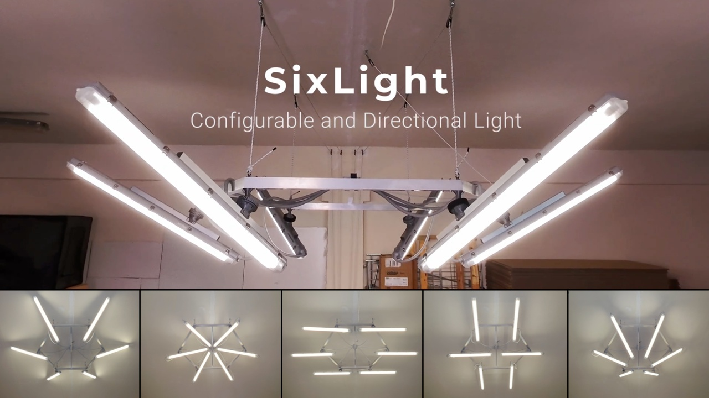

# SixLight – Modular Hexagonal LED System with Adjustable Joints

**SixLight** is an open-source modular lighting system designed for creators, makers, and content producers. It combines industrial reliability with DIY flexibility, allowing you to build a durable, adjustable LED light for your studio, workshop, or filming setup.

---

## 🧱 Structure & Design

SixLight is built around a hexagonal frame made of 50x50 mm aluminum tubes, each 2 mm thick. The industrial LED housing are attached to the frame using custom-designed spherical joints, which allow for a wide range of positioning. Aluminum tubes were chosen to keep the cost low, but using carbon fiber tubes would significantly reduce the weight and improve maneuverability.

Each joint can be tightened to lock the light in a desired direction, offering a semi-rigid structure that remains flexible during setup but stable during use.

---

## 🔩 What's Inside

- 3D-printable STL files for the spherical joints and mounting elements
- STEP files for modification
- PDF assembly guide and wiring diagram
- Images of the final assembly

---

## 🛠️ Requirements

- Aluminum tubes (50x50 mm and 30x30 mm, 2 mm thick)
- 120cm led batten and housing
- Standard screws, nuts and bolts
- 3D printer for joint fabrication

---

## 🚀 Potential Improvements

Here are some possible upgrades and features that could enhance future versions of SixLight:

- **Remote control of individual lamps** for power or on/off switching
- **Brightness adjustment** through dimmable drivers or smart controllers
- **Replacement of the spherical joints** with motorized articulation systems to remotely adjust lamp orientation
- **Motorized ceiling rigging** to raise or lower the four suspension points for positioning and maintenance

---

## 📜 License

This project is licensed under **Creative Commons BY-NC-SA 4.0**.  
You may use, modify, and share this project for **non-commercial** purposes only.

🔒 **Commercial use is not allowed without a separate agreement.**  
If you're a company or manufacturer interested in using or producing this system, please contact us.

---

## ⚠️ Disclaimer

This project is provided **"as is"** without any warranty of any kind, either express or implied.

By using, building, or modifying this project, you agree that:

- You do so **at your own risk**.
- The author(s) are **not responsible for any damage**, injury, or loss that may result from the use or misuse of this design.
- This project involves **electrical components** and **structural parts** that, if improperly built or installed, may cause **fire, electric shock, injury, or property damage**.
- It is **your responsibility** to verify the safety, compliance, and suitability of the design for your specific application.

Always follow local safety regulations and consult a qualified professional when working with electricity or mechanical structures.
