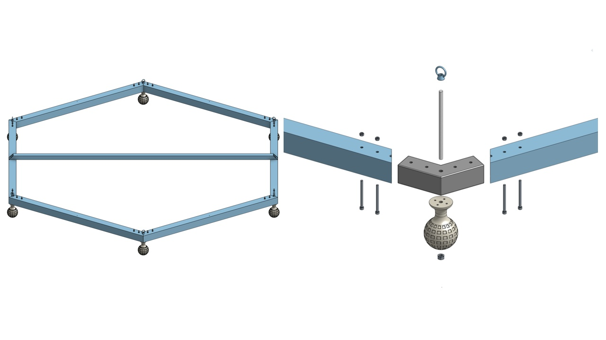
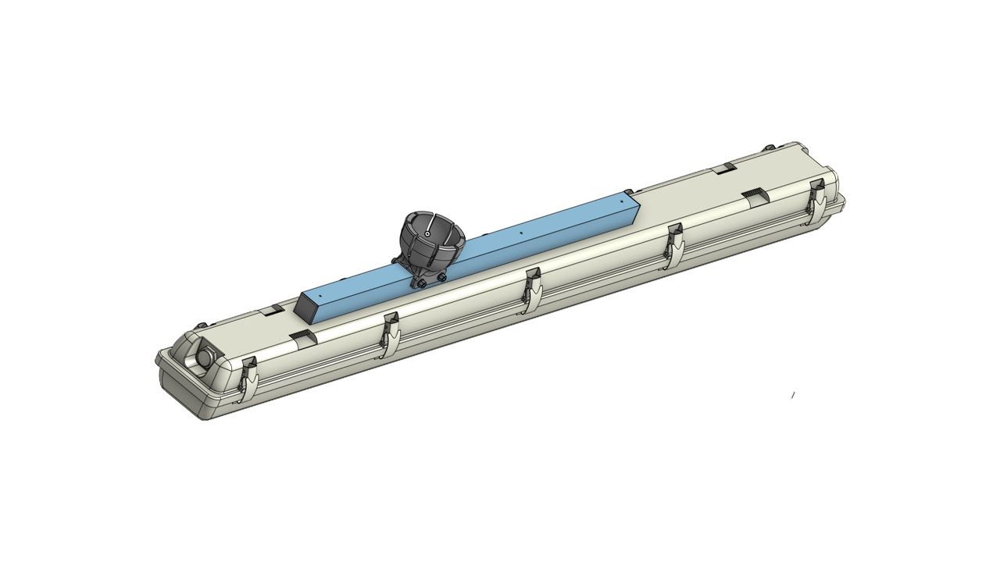
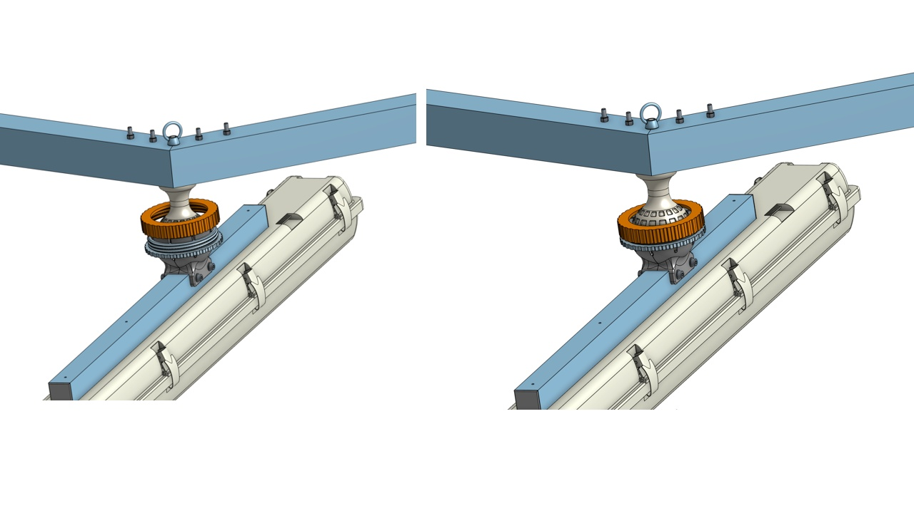
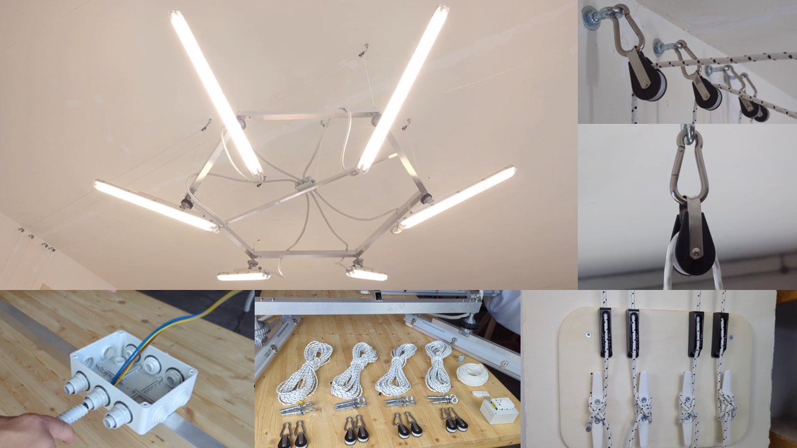

# SixLight – Assembly Guide

> This guide covers the assembly of the **SixLight** lamp structure only.  
> This is a short illustrated guide to the **SixLight** lamp structure only.
> Electrical wiring and the ceiling pulley system are not described here but referenced in the final images.

---

## 📦 Part List

| Part number | Quantity | Description                                              |
|-------------|----------|----------------------------------------------------------|
| 001           | 6        | 50x50x1000mm Alluminium profile 2mm thickness          |
| 002           | 6        | 3d printed frame joint                                 |
| 003           | 6        | 3d printed sphere                                      |
| 004           | 6        | M8 x 165mm threaded bar                                |
| 005           | 24       | Hex socket head cap screw M5x0.80 x 65 Stainless Steel |
| 006           | 6        | Self-locking hex nut M8 Stainless Steel                |
| 007           | 24       | Hex nut M5 Stainless Steel                             |
| 008           | 6        | M8 eyebolt                                             |
| *009*         | *6*      | *Assembly of LED fixtures (cad reference)*             |
| 010           | 12       | 3d printed Caps                                        |
| 011           | 6        | Industrial 120cm LED batten housing                    |
| 012           | 6        | 30x30x640mm Alluminium profile 2mm thickness           |
| 013           | 12       | Symmetrical half ball socket                           |
| 014           | 6        | Female threaded fixing ring                            |
| 015           | 6        | Male threaded fixing ring                              |
| 016           | 24       | M5 Stainless Steel washer                              |
| 017           | 12       | Hex nut M5 Stainless Steel                             |
| 018           | 12       | Hex socket head cap screw M5 x 50 Stainless Steel      |
| 019           | 1        | 30x30x1818mm Alluminium profile 2mm thickness          |
| 020           | 24       | Aluminium rivet Ø 3 mm × 10 mm                         |
| 021           | 2        | Aluminium rivet Ø 5 mm × 10 mm                         |

---

## 🖨️ 3D Printing Recommendations

All parts were printed using a Bambu Lab X1 Carbon with a 0.6 mm nozzle and basic PLA without any supports.

All components, except for the spherical joint, are printed with **100% infill** for maximum strength.

The sphere is printed with:
- **5 perimeters**
- **6 bottom layers**
- **6 top layers**
- **30% infill**

Since the joint relies on precise fit, it is recommended to **print one piece first** and test the assembly.  
If the fit is too tight or too loose, adjust the slicer's **external dimension parameters** slightly until the desired tolerance is achieved.

!IMPORTANT - To ensure smooth threading and avoid jamming on the layer ridges of the printed part, components 013 (spherical jaw halves) and 015 (male threaded fixing ring) should be sanded with fine-grit sandpaper.

---

## 🧱 Frame Overview

The SixLight frame is composed of six 50x50 mm aluminum tubes arranged in a hexagon.  
At each corner, a 3D printed spherical housing is mounted.

Using carbon fiber tubes instead of aluminum can reduce the total frame weight by over 3 kg, while maintaining similar dimensions.

### Parts shown in the picture:
- **001** – 50x50x1000mm Aluminium profile 2mm thickness  
- **002** – 3d printed frame joint  
- **003** – 3d printed sphere  
- **004** – M8 x 165mm threaded bar  
- **005** – Hex socket head cap screw M5x0.80 x 65 Stainless Steel  
- **006** – Self-locking hex nut M8 Stainless Steel  
- **007** – Hex nut M5 Stainless Steel  
- **008** – M8 eyebolt
- **019** - 30x30x1818mm Alluminium profile 2mm thickness

> Apply threadlocker to the M8 eyebolt (part 008) and the M8 self-locking nut (part 006) during assembly to ensure long-term stability.

---

## 💡 LED Fixture Mounting

Each LED batten is mounted on a reinforced aluminum tube (30x30 mm), riveted for strength.  
At each end of the reinforcement bar, two spherical mount halves are fixed to form a housing for the ball joint.

### Parts used in the picture:
- **010** – 3d printed Caps  
- **011** – Industrial 120cm LED batten housing  
- **012** – 30x30x640mm Aluminium profile 2mm thickness  
- **013** – Symmetrical half ball socket  
- **016** – M5 Stainless Steel washer  
- **017** – Hex nut M5 Stainless Steel  
- **018** – Hex socket head cap screw M5 x 50 Stainless Steel  
- **020** – Aluminium rivet Ø 3 mm × 10 mm

---

## 🔧 Spherical Clamp Assembly

Each sphere fits into a set of two spherical jaws that cradle it securely.  
These are held together with a threaded clamping ring.

### Parts shown in the picture:
- **014** – Female threaded fixing ring
- **015** – Male threaded fixing ring

Once tightened, the lamp remains in the selected position.  
The joint allows for a full 360° rotation and ±30° tilt.

---

## 🖼️ Final Assembly & Installation Example

This version was fixed to the ceiling using a commercial pulley and cable system.  
The electrical connection is made via standard 220V AC cabling *(see local regulations)*.

---

## ⚠️ Disclaimer

This guide is provided **as is**, without warranty.  
Always ensure proper mechanical and electrical safety during construction and use.
